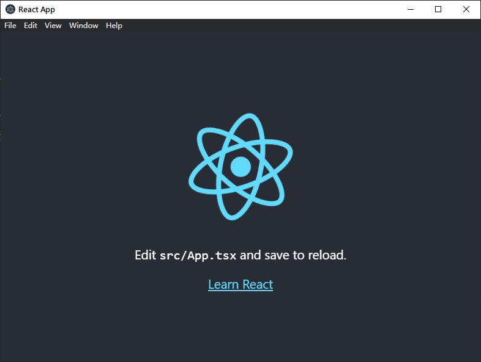

## 环境

- Windows 10
- NodeJS 12
- WebStorm
- VSCode（编写 markdown 文档）

## 创建 lerna 项目

创建目录 _electron_example_，然后使用 yarn 初始化

```sh
mkdir electron_example && cd electron_example
yarn init -y
```

修改 _package.json_

```json
{
  "name": "electron_example",
  "version": "1.0.0",
  "private": true,
  "license": "MIT",
  "workspaces": {
    "packages": ["apps/*"]
  }
}
```

随后创建 _lerna.json_ 配置文件

```json
{
  "packages": ["apps/*"],
  "version": "independent",
  "npmClient": "yarn",
  "useWorkspaces": true
}
```

初始化目录如下

- _apps_
  - _main_: 主进程
  - _renderer_: 渲染进程
- _node_modules_
- _lerna.json_
- _package.json_
- _yarn.lock_

> 参考: <https://github.com/rxliuli/electron_example/tree/b9628e1fd16bb5b6807e55e9ca72fdf2daf5bfde>

## 初始化渲染层模块

在 renderer 目录中使用 create-react-app 创建一个 react 项目，并添加

```sh
npx create-react-app apps/renderer/ --template typescript
```

不过还需要修改其中部分配置，主要包含

- 删除 _yarn.lock_ 或 _package-lock.json_ 文件

> 参考: <https://github.com/rxliuli/electron_example/tree/8e0920af985e1201fc05ca36302e094532843c2d>

尝试再 yarn 安装依赖，接着再使用 `yarn start` 启动开发环境，应该可以在浏览器中看到默认的页面。


## 初始化主进程模块

> 参考: <https://github.com/rxliuli/electron_example/tree/a78885b76de9322dfdac82e2c220b7c6e0a9617f>
> 注：electron 版本选择双数，生命周期更长。

初始化主进程模块，主要包括

### 为主进程创建 package.json

```json
{
  "name": "main",
  "version": "0.1.0"
}
```

### 添加依赖 `yarn add electron electron-builder typescript`

```json
// package.json
{
  "devDependencies": {
    "electron": "^10.2.0",
    "electron-builder": "^22.9.1",
    "typescript": "^4.1.3"
  }
}
```

### 添加 _tsconfig.json_ 配置文件

```json
// tsconfig.json
{
  "compilerOptions": {
    // nodejs 生态大多数都支持这种模块
    "module": "commonjs",
    // 优先考虑输出 es5
    "target": "es5",
    // 但不要自缚手脚，仍然使用最新的 es 特性
    "lib": ["ESNext"],
    // 定义源目录与输出目录
    "rootDir": "src",
    "outDir": "dist",
    // 生成 sourceMap 方便 IDE 本地调试
    "sourceMap": true,
    // 禁止 ts 检查 npm 依赖的类型定义（例如 electron 的类型定义就很容易被 ts 检查出错误，毕竟这个项目实在太大了）
    "skipLibCheck": true,
    "skipDefaultLibCheck": true
  },
  // 排除依赖目录与输出目录
  "exclude": ["node_modules", "dist"]
}
```

### 添加 _src/main.ts_ 基本的启动文件

```ts
// src/main.ts
import { app, BrowserWindow } from 'electron'

async function createMainWindow() {
  // 创建新的 electron 窗口
  const mainWindow = new BrowserWindow()
  // 载入开发环境的 url
  await mainWindow.loadURL('http://localhost:3000/')
}

/**
 * main 函数
 */
async function main() {
  app.on('ready', createMainWindow)
}

main()
```

### 更新 _package.json_ 添加几个 npm script

```json
// package.json
{
  "scripts": {
    // 编译 ts 代码
    "compile": "tsc",
    // 编译 tsc 代码且启动监听模式
    "watch": "yarn compile -w",
    // 在主进程通过 lerna 启动渲染进程模块的开发环境
    "dev:web": "lerna run --scope renderer start",
    // 启动主进程的开发环境
    "dev:electron": "electron ./dist/main.js"
  }
}
```

接下来，我们通过这些 npm script 启动 electron 开发环境

1.  运行 `yarn watch`
1.  运行 `dev:web`
1.  等待以上两条命令都运行完成，再继续运行 `dev:electron`

现在，你应该可以看到一个 electron 窗口，其中显示着。



## 总结

目前，使用 lerna monorepo 似乎还看不出来明显的优点，不过实际上在后面逐步完善 Electron 程序的过程中我们会发现它的强大之处。
