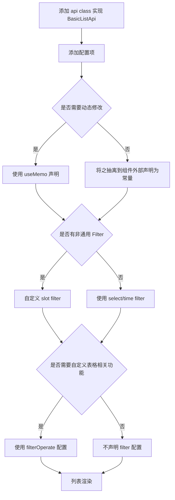
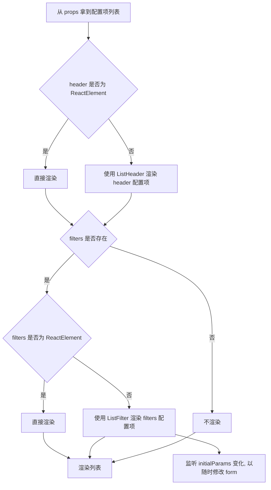

## 场景

> [GitHub 源码](https://github.com/rxliuli/example/tree/master/basic_list)

在后台项目中，即便使用了 antd，仍然存在太多太多的列表页面。这些列表页面大多数又是非常相似的，所以吾辈需要解决重复的简单列表的编写，避免每次都手动控制过滤器/分页之类的东西，将之抽象成配置项，然后通过配置生成列表页面。或许已经有很多人做过了这件事情，但于吾辈而言，这仍然是全新的体验，所以也便于此记录，并供之以他人参考。

## 理念

使用逐级递进的方式进行封装，使用者可以根据需求停留在一个合适的封装层次，使用不同封装层次的组件。

- `BasicList`：高层列表封装组件
  - `ListHeader`：列表页顶部工具栏组件
    - `CommonHeader`: 通用的顶部工具栏组件
  - `ListFilter`：过滤器组件
    - `FilterSelect`：单选过滤器
    - `FilterTimeRange`：时间区间过滤器
    - `FilterSlot`：自定义过滤器
  - `ListTable`：列表封装组件

BasicList 使用步骤



BasicList 渲染流程



## 使用示例

### 使用基本 API

> [GitHub 代码示例](https://github.com/rxliuli/example/blob/master/basic_list/src/pages/example/BasicListExample.tsx)

如下所示，我们想要构造下面这样一个简单的列表页面，包含一个面包屑导航列表、搜索框、过滤条件选择器和一个表格。

```tsx
import * as React from 'react'
import { Button } from 'antd'
import { Link } from 'react-router-dom'
import { Moment } from 'moment'
import { LabeledValue } from 'antd/es/select'
import { userApi } from './api/UserApi'
import {
  BasicList,
  BasicListPropsType,
  FilterFieldTypeEnum,
} from '../../components/list'

type PropsType = {}

type Config = Omit<BasicListPropsType, 'params'> & {
  params?: {
    keyword?: string
    test?: number
    birthdayTimeRange?: [Moment, Moment]
  }
}
const testOptionList: LabeledValue[] = [
  { value: 0, label: '测试 0' },
  { value: 1, label: '测试 1' },
  { value: 2, label: '测试 2' },
]

//列表配置项
const config: Config = {
  header: {
    placeholder: '用户名/住址',
    list: ['用户', '列表'],
  },
  filters: [
    {
      type: FilterFieldTypeEnum.Select,
      label: '测试字段',
      field: 'test',
      options: testOptionList,
    },
    {
      type: FilterFieldTypeEnum.TimeRange,
      label: '生日',
      field: 'birthdayTimeRange',
    },
  ],
  columns: [
    { field: 'id', title: 'ID' },
    { field: 'name', title: '姓名' },
    { field: 'birthday', title: '生日' },
    {
      field: 'operate',
      title: '操作',
      slot: (param) => <Link to={`/system/user/${param.record.id}`}>详情</Link>,
    },
  ],
  api: userApi,
}

/**
 * 一个基本的列表页面
 * @constructor
 */
const BasicListExample: React.FC<PropsType> = () => {
  return <BasicList {...config} />
}

export default BasicListExample
```

### 使用自定义过滤器组件

> [GitHub 代码示例](https://github.com/rxliuli/example/blob/master/basic_list/src/pages/example/CustomFilterListExample.tsx)

事实上，总有各种奇怪的过滤器无法满足，这时候就需要添加一个自定义的过滤器了。
例如下面这个过滤器，包含了年龄的值和单位，是不是感觉很奇怪

关键代码配置如下

```jsx
const config: Config = {
  filters: [
    {
      type: FilterFieldTypeEnum.Slot,
      label: '年龄',
      field: 'age',
      children: (
        <Input.Group compact>
          <Form.Item name={['age', 'value']} noStyle>
            <InputNumber style={{ width: 'calc(100% - 64px)' }} />
          </Form.Item>
          <Form.Item name={['age', 'unit']} noStyle>
            <Select style={{ width: 64 }} options={ageUnitOptionList} />
          </Form.Item>
        </Input.Group>
      ),
    },
  ],
  // 此处是为了添加过滤器的默认值
  params: {
    age: {
      unit: 0,
    },
  },
}
```

### 添加表格的额外操作

> [GitHub 代码示例](https://github.com/rxliuli/example/blob/master/basic_list/src/pages/example/TableOperationListExample.tsx)

有时候，我们需要添加一个额外的表格操作，例如导出/导入数据/删除选中数据。

关键代码如下

```jsx
async function handleBatchDelete({
  selectedRowKeys,
  setSelectedRowKeys,
  searchPage,
}: ListTableOperateParam) {
  if (selectedRowKeys.length === 0) {
    return
  }
  await userApi.batchDelete(selectedRowKeys)
  setSelectedRowKeys([])
  await searchPage()
}

const config = useMemo<Config>(
  () => ({
    tableOperate: (params) => (
      <Button onClick={() => handleBatchDelete(params)}>删除选中</Button>
    ),
  }),
  [],
)
```

### 过滤器的下拉框数据来源是异步的

> [GitHub 代码示例](https://github.com/rxliuli/example/blob/master/basic_list/src/pages/example/AsyncSelectOptionsListExample.tsx)

很多时候，我们的数据来源并不是由前端写死，而是从后台获取的，这就要求我们传入的值是 react 的一个 State 而非一个固定值。

关键代码如下

```jsx
const testOptionList = useAsyncMemo([], dictApi.list)
const config = useMemo<Config>(
  () => ({
    filters: [
      {
        type: FilterFieldTypeEnum.Select,
        label: '测试字段',
        field: 'test',
        options: testOptionList,
      },
    ],
  }),
  [testOptionList],
)
```

## 组件 API

### BasicList

参考 _src/components/common/table/js/BasicListOptions.d.ts_

| `prop`           | 类型                                                               | 说明           |
| ---------------- | ------------------------------------------------------------------ | -------------- |
| `header`         | `BasicList.Header`                                                 | 标题栏相关配置 |
| `[filters]`      | `BaseFilterField[]`                                                | 过滤器列表     |
|                  | `((params: any, onChange: (params: any) => void) => ReactElement)` |                |
| `[params]`       | `Params`                                                           | 查询参数       |
| `columns`        | `TableColumn[]`                                                    | 列字段列表     |
| `api`            | `BaseListApi`                                                      | api 对象       |
| `[tableOptions]` | `TableOptions`                                                     | 一些其他选项   |
| `[tableOperate]` | `ListTableOperate`                                                 | 一些其他操作   |

### ListFilter

\| `prop` | 类型 | 说明 |
\| ---------------- | -------------------- | ------------------------ | ------------------ | ---------- |
\| `[initialValue]` | `any` | 查询参数 |
\| `filters` | `(FilterSelectType | FilterTimeRangeType | FilterSlotType)[]` | 过滤器列表 |
\| `onChange` | `(value: T) => void` | 当过滤器的参数发生改变时 |

### ListTable

| `prop`           | 类型               | 说明         |
| ---------------- | ------------------ | ------------ |
| `columns`        | `TableColumn[]`    | 列字段列表   |
| `api`            | `BaseListApi`      | api 对象     |
| `params`         | `Params`           | 查询参数     |
| `[tableOptions]` | `TableOptions`     | 一些其他选项 |
| `[tableOperate]` | `ListTableOperate` | 一些其他选项 |

## 其他类型定义

下面是类型定义，所有的类型定义都有对应的 `.d.ts` 文件，请使用 `C-N` 搜索 `class`。

| `HeaderNavItem` | 类型     | 说明                      |
| --------------- | -------- | ------------------------- |
| `string`        |          | 导航的名字                |
| `name`          | `string` | 导航的名字                |
| `[link]`        | `string` | 如果是 route 的话必须有值 |

| `Header`      | 类型              | 说明             |
| ------------- | ----------------- | ---------------- |
| `list`        | `HeaderNavItem[]` | 导航元素列表     |
| `placeholder` | `string`          | 搜索框的提示文本 |

### 过滤器相关

| `FilterFieldTypeEnum` | 类型 | 说明           |
| --------------------- | ---- | -------------- |
| `Slot`                | `1`  | 自定义 slot    |
| `Select`              | `2`  | 普通选择框     |
| `TimeRange`           | `3`  | 日期区间选择器 |

| `FilterFieldBase` | 类型                  | 说明           |
| ----------------- | --------------------- | -------------- |
| `type`            | `FilterFieldTypeEnum` | 过滤器元素类型 |
| `label`           | `string`              | 显示的标题     |

| `FilterSelectType` | 类型              | 说明               |
| ------------------ | ----------------- | ------------------ |
| `extends`          | `FilterFieldBase` | 继承基本过滤器配置 |
| `field`            | `string`          | 字段名             |
| `options`          | `LabeledValue[]`  | 值列表             |

| `FilterTimeRangeType` | 类型              | 说明               |
| --------------------- | ----------------- | ------------------ |
| `extends`             | `FilterFieldBase` | 继承基本过滤器配置 |
| `field`               | `string`          | 字段名             |

| `FilterSlotType` | 类型                                                            | 说明                 |
| ---------------- | --------------------------------------------------------------- | -------------------- |
| `extends`        | `FilterFieldBase`                                               | 继承基本过滤器配置   |
| `field`          | `string`                                                        | 字段名               |
| `children`       | `ReactElement`                                                  | `Form.Item` 的子元素 |
| `[computed]`     | `(res: Record<string, any>, value: any) => Record<string, any>` | 自定义计算方法       |

| `Params`  | 类型     | 说明         |
| --------- | -------- | ------------ |
| `keyword` | `string` | 查询关键字   |
| `...args` | `any[]`  | 其他查询参数 |

### 表格相关

| `TableColumn` | 类型                                                             | 说明                   |
| ------------- | ---------------------------------------------------------------- | ---------------------- |
| `field`       | `string`                                                         | 在数据项中对应的字段名 |
| `title`       | `string`                                                         | 列标题                 |
| `[formatter]` | `(v: any, record: any) => any`                                   | 自定义字段格式化函数   |
| `[slot]`      | `(param: { text: string; record: any; i: number }) => ReactNode` | 自定义 `slot`          |

| `BaseListApi` | 类型                                     | 说明                                       |
| ------------- | ---------------------------------------- | ------------------------------------------ |
| `pageList`    | `(params: any) => Promise<PageRes<any>>` | 所有 ListTable 中的 api 对象必须实现该类型 |

| `ListTableOperateParam` | 类型                                  | 说明                 |
| ----------------------- | ------------------------------------- | -------------------- |
| `searchPage`            | `(page?: PageParam) => Promise<void>` | 导航元素列表         |
| `selectedRowKeys`       | `string[]`                            | 当前选中行的主键     |
| `setSelectedRowKeys`    | `(selectedRowKeys: string[]) => void` | 设置当前选中行的主键 |
| `page`                  | `PageData<any>`                       | 分页数据信息         |
| `params`                | `Params`                              | 过滤器及搜索参数     |

| `TableOptions` | 类型      | 说明                   |
| -------------- | --------- | ---------------------- |
| `[isSelect]`   | `boolean` | 是否可选，默认为 false |
| `[rowKey]`     | `string`  | 行的唯一键，默认为 id  |

## 总结

相比于之前吾辈 [vue 的初版 List 封装](https://blog.rxliuli.com/p/aa3fd9e1/)，嗯，差距非常明显！
