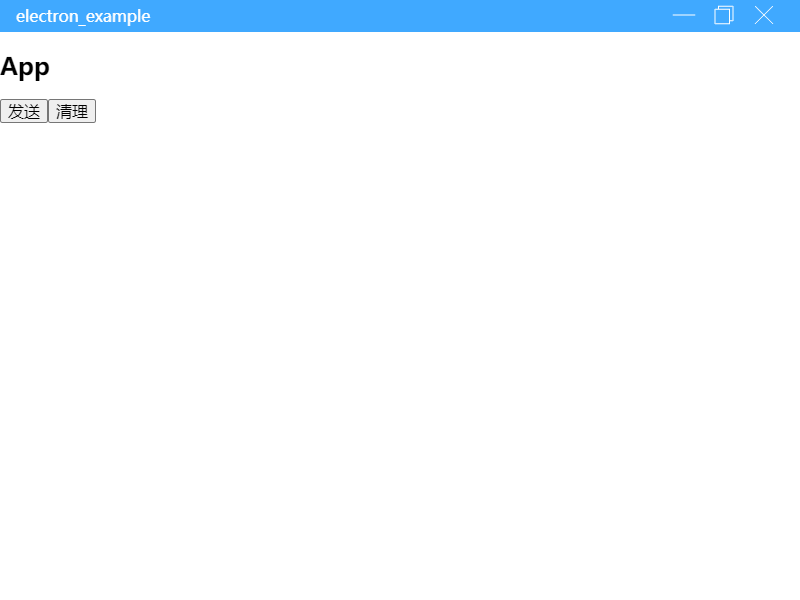

## 场景

在很多生产项目中，我们希望自定义 electron 窗口顶栏，因为它确实非常简陋。

## 步骤

### 在渲染层实现自定义顶栏

实际上，核心的代码就是添加一个为顶栏的元素添加 css 样式。在 electron 环境，有 `-webkit-app-region: drag;` 属性的元素可以拖动整个窗口。

```css
.toolbar {
  -webkit-app-region: drag;
}
.toolbar > * {
  -webkit-app-region: no-drag;
}
```

上面的 css 看起来有点奇怪，但这是为了避免子元素（例如关闭按钮）也可以拖动的错误。

> [参考文档](https://www.electronjs.org/docs/api/browser-window#event-system-context-menu-windows), [参考代码](https://github.com/rxliuli/electron_example/blob/18a1a756e5c82e87ef1c8755a0be036b6765f04b/apps/renderer/src/components/router/component/BasicLayout.module.css#L13)

### 使用 electron 通信实现窗口的三个操作

其实，electron 本身支持在渲染层暴露 `remote` 模块，但这里我们选择使用 `ipcRenderer/ipcMain` 手动实现，remote 模块因为安全原因默认被禁用了。

下面的步骤基本和 [渲染、主进程通信](/p/6e778ce220e042a0902e7a85976e7e47) 所属一样，下面贴一些关键代码

共享类型

```ts
// WindowDefine.ts
import { BaseDefine } from 'electron_ipc_type'

export interface WindowDefine extends BaseDefine<'WindowApi'> {
  action(type: 'min' | 'max' | 'close'): void
}
```

主进程

```ts
// main.ts
class WindowApi {
  async action(e: IpcMainInvokeEvent, type: 'min' | 'max' | 'close') {
    const win = BrowserWindow.fromWebContents(e.sender)
    switch (type) {
      case 'min':
        win.minimize()
        break
      case 'max':
        win.isMaximized() ? win.unmaximize() : win.maximize()
        break
      case 'close':
        win.close()
        break
    }
  }
}
```

渲染进程

```ts
// BasicLayout.tsx
const windowApi = IpcRendererClient.gen<WindowDefine>('WindowApi')

/**
 * 封装 electron 的窗口控制 hooks
 */
function useElectronWindowControl() {
  return {
    handleMin: () => windowApi.action('min'),
    handleMax: () => windowApi.action('max'),
    handleClose: () => windowApi.action('close'),
  }
}
```

> [参考代码](https://github.com/rxliuli/electron_example/tree/3aea837b0c7661e030406a0c20d306694402a26f)

### 隐藏掉默认的顶栏

实际上，只要在创建 electron 的 `BrowserWindow` 实例时配置即可

```ts
new BrowserWindow({
  webPreferences: {
    nodeIntegration: true,
  },
  frame: false,
  autoHideMenuBar: true,
})
```

现在，electron 程序就有自定义顶栏啦



## 问题

虽然自定义窗口顶栏有很多优点，但也并非尽善尽美，已知缺点如下

- 占有了一定高度，导致一些 UI 组件的位置很奇怪，例如顶部的消息提示框和侧边抽屉，会遮挡住窗口顶栏的一部分。
- 可能随着系统升级与系统风格不搭，早有人吐槽过 Windows 所有程序的自定义顶栏都是不一样的高度和大小，非常丑
- 需要重新实现窗口菜单相关的快捷键，例如 `ctrl+shift+i` 打开开发者工具
- 在 mac 上需要进行特别的兼容，否则和其他程序会显得格格不入
