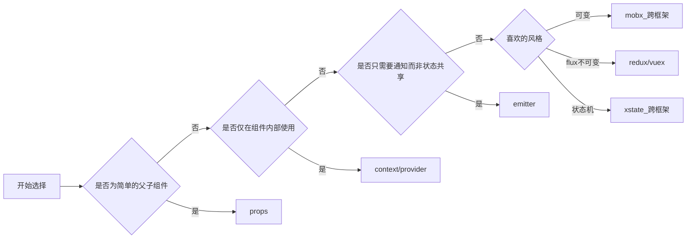

## 场景

> 吾辈同时是 vue/react 的使用者。

在使用现代前端框架时，我们经常要要面对的问题之一就是组件之间的通信，目前我们有着很多选择，包括但不限于以下这些。

- `Super Component Props`: 将状态或操作放在父组件，然后传递到子组件。该特性在 vue/react 都存在
- `Context/Provider Pattern`: 将状态放在父组件，然后所有的子组件都可以获取到。例如 react 中的 context 或 vue 中的 `provide/inject`
- `Global State`: 全局状态管理器。包含 redux/vuex/mobx/xstate 等一系列状态管理器。
- `EventEmitter`: 全局事件触发器。包含 nodejs 和一些第三方实现。

然而，有了如此多的解决方案，到底该在那些场景下使用那些解决方案呢？

## 分类

首先，我们将以上组件通信的解决方案分为两类

| 解决方案                   | 是否在 react 生命周期中 |
| -------------------------- | ----------------------- |
| `Super Component Props`    | √                       |
| `Context/Provider Pattern` | √                       |
| `Global Store`             | ×                       |
| `EventEmitter`             | ×                       |

选择树



### `Super Component Props`

> 适合简单的父子组件通信。参考: [组件 & Props](https://zh-hans.reactjs.org/docs/components-and-props.html)

为什么 `props` 适合简单的父子通信呢？因为 `props` 是框架中基础的父子组件通信方式，模板代码也是最少的。

下面是一个简单的示例：将一个组件内输入框的值渲染到另一个组件中。


```tsx
const Hello: React.FC<{ name: string }> = (props) => {
  return (
    <section>
      <h3>hello {props.name}</h3>
    </section>
  )
}

const InputName: React.FC<
  Pick<InputHTMLAttributes<HTMLInputElement>, 'value' | 'onChange'>
> = (props) => {
  return <input {...props} />
}

const App = () => {
  const [name, setName] = useState('')
  return (
    <div>
      <InputName value={name} onChange={(e) => setName(e.target.value)} />
      <Hello name={name} />
    </div>
  )
}
```

如题，对于这种简单的父子组件传值，使用 props 是最简单合适的。

下面演示使用其他几种方式的实现

---

使用 context

```tsx
const HelloContext = React.createContext<{
  name: string
  setName: (name: string) => void
}>({
  name: '',
  setName: () => {},
})

const Hello: React.FC = () => {
  // 模板代码
  const context = useContext(HelloContext)
  return (
    <section>
      <h3>hello {context.name}</h3>
    </section>
  )
}

const InputName: React.FC = () => {
  // 模板代码
  const context = useContext(HelloContext)
  return (
    <input
      name={context.name}
      onChange={(e) => context.setName(e.target.value)}
    />
  )
}

const App = () => {
  const [name, setName] = useState('')
  return (
    <HelloContext.Provider value={{ name, setName }}>
      <InputName />
      <Hello />
    </HelloContext.Provider>
  )
}
```

可以看到，加的 context 能被深层子组件读取的优势并未体现出来，反而多了一些模板代码。

---

使用 global state，此处使用 mobx 进行演示

```tsx
// 模板代码
class HelloStore {
  @observable
  name = ''
  @action
  setName(name: string) {
    this.name = name
  }
}

const helloStore = new HelloStore()

const Hello: React.FC = observer(() => {
  return (
    <section>
      <h3>hello {helloStore.name}</h3>
    </section>
  )
})

const InputName: React.FC = observer(() => {
  return (
    <input
      name={helloStore.name}
      onChange={(e) => helloStore.setName(e.target.value)}
    />
  )
})

const App = () => {
  // 模板代码
  useMount(() => {
    helloStore.setName('')
  })
  return (
    <div>
      <InputName />
      <Hello />
    </div>
  )
}
```

可以看到，store 是全局可用的，但也需要在相应组件内做初始化动作，而非像 props/context 那样受组件生命周期控制，自动的初始化和销毁状态。

---

```tsx
const em = new EventEmitter<{
  update: [string]
}>()

const Hello: React.FC = () => {
  // 模板代码
  const [name, setName] = useState('')
  // 模板代码
  useEffectOnce(() => {
    em.add('update', setName)
    return () => {
      em.remove('update', setName)
    }
  })
  return (
    <section>
      <h3>hello {name}</h3>
    </section>
  )
}

const InputName: React.FC = () => {
  // 模板代码
  const [name, setName] = useState('')
  function handleChange(e: ChangeEvent<HTMLInputElement>) {
    const value = e.target.value
    setName(value)
    // 模板代码
    em.emit('update', value)
  }
  return <input name={name} onChange={handleChange} />
}

const App = () => {
  return (
    <div>
      <InputName />
      <Hello />
    </div>
  )
}
```

可以看到，emitter 可以在不改变原有组件(`InputName`)的情况下在新的组件添加相关的逻辑，但确实会多一些模板代码，且需要维护两次状态。

### `Context/Provider Pattern`

> 适合深层的父组件共享状态给多个子组件，有时候会结合 `EventEmitter` 一起使用。

为什么我们有了 props，甚至有了更强大的 `render props`（vue 中被称为 `slot`），却还是需要 context 呢？

考虑以下场景，我们想要为一颗组件树的所有组件添加一些全局特性，例如 `theme`、`local`、`全局配色`，而你使用这些状态的组件又分散在各个地方时，便可以考虑使用 context。相比于全局状态，context 仅与框架而非状态管理库绑定，这对于第三方库（尤其是 UI 组件库）是大有益处的，例如 [rc-field-form](https://github.com/react-component/field-form) 和 [react-router](https://github.com/ReactTraining/react-router) 均有如此实现。理论上，当我们需要状态共享但 props 又不需要在组件外操作状态时，就应该首先选择 context。

下面是一个简单的示例来说明使用 context 实现全局的 theme 控制。

```tsx
type ThemeContextType = {
  color: 'light' | 'black'
}
const ThemeContext = React.createContext<ThemeContextType>({
  color: 'light',
})
const Theme = ThemeContext.Provider

const Button: React.FC = (props) => {
  const context = useContext(ThemeContext)
  return (
    <button className={context.color !== 'black' ? 'light' : 'black'}>
      {props.children}
    </button>
  )
}
const Tag: React.FC = (props) => {
  const context = useContext(ThemeContext)
  return (
    <span className={context.color !== 'black' ? 'light' : 'black'}>
      {props.children}
    </span>
  )
}
const App = () => {
  return (
    <Theme value={{ color: 'black' }}>
      <Button>按钮</Button>
      <Tag>标签</Tag>
    </Theme>
  )
}
```

问题

- 仅限于同一个父组件树下的两个子组件共享状态，当然你也可以说所有的组件都只有**单根**。
- 无法在组件外部使用，这点是致命的，例如路由 `history` 对象弹窗无法在逻辑层使用是不可接受的（需要在请求接口报 404 时跳转登录页面）。
- 使用时的模板代码要稍微更多一点，相比与 mobx 的话。

### `Global Store`

> 适合在组件树上相隔较远的组件/组件外共享状态和逻辑使用。

那么，继续来看以下场景，当我们需要在多个组件/组件外共享状态时，例如当前登录的用户信息，便应该优先考虑使用状态管理器。

```tsx
interface UserInfo {
  id: string
  username: string
  nickname: string
}
class UserStore {
  @observable
  userInfo?: UserInfo
  refresh(userInfo: UserInfo) {
    this.userInfo = userInfo
  }
}

const userStore = new UserStore()

async function post<T>(url: string, data: object) {
  const response = await fetch(url, {
    method: 'post',
    headers: {
      'Content-Type': 'application/json',
    },
    body: JSON.stringify({
      client: {
        //在组件外使用用户信息
        uid: userStore.userInfo?.id,
      },
      data: data,
    }),
  })
  return (await response.json()) as T
}

type UserInfoForm = { username: string; password: string }
const Login: React.FC = () => {
  const [form, dispatchForm] = useReducer<
    Reducer<UserInfoForm, { name: keyof UserInfoForm; value: string }>
  >(
    (state, action) => {
      return {
        ...state,
        [action.name]: action.value,
      }
    },
    { username: '', password: '' },
  )
  async function handleSubmit(e: FormEvent<HTMLFormElement>) {
    e.preventDefault()
    console.log('handleSubmit: ', form)
    //登录时刷新用户信息
    const userInfo = await post<UserInfo>('/login', form)
    userStore.refresh(userInfo)
  }
  return (
    <form onSubmit={handleSubmit}>
      <div>
        <label htmlFor={'username'}>用户名：</label>
        <input
          name={'username'}
          value={form.username}
          onChange={(e) =>
            dispatchForm({
              name: 'username',
              value: e.target.value,
            })
          }
        />
      </div>
      <div>
        <label htmlFor={'password'}>密码：</label>
        <input
          name={'password'}
          type={'password'}
          value={form.password}
          onChange={(e) =>
            dispatchForm({
              name: 'password',
              value: e.target.value,
            })
          }
        />
      </div>
      <div>
        <button type={'submit'}>提交</button>
      </div>
    </form>
  )
}
const App = observer(() => {
  return (
    <div>
      {/*在组件中使用 store 的值*/}
      <header>{userStore.userInfo?.nickname}</header>
    </div>
  )
})
```

问题

- 需要自己管理状态的初始化与清理，不跟随组件的生命周期进行变化。
- 全局状态是混乱的根源，过度使用害人害己
- 无论何时都存在，占用额外的内存资源

### `EventEmitter`

> 适合用于逻辑层的状态通信或是组件之间的监听/通知操作，不修改组件状态存储的结构，无法复用状态。

在不想改变组件状态/操作的代码结构而仅仅只是想要简单的通信时，EventEmitter 是一种合适的方式。设想以下场景，当你已经写完了一个复杂的组件，而突然 UI/UX 又在另一个相隔很远的地方添加了另一个相关的组件并且需要通信时，在你不想对原组件大刀阔斧的改动时，那么 EventEmitter 是一个合适的选择。

例如下面这段代码，假设你已经写完了复杂的 MainContent 组件（当然下面代码中的 MainContent 并不算复杂），但后来需求变化，想在 Header 组件中添加一个刷新按钮，而不希望变更代码状态结构的时候，便可以尝试使用 EventEmitter 了。

```tsx
/**
 * 随机数生成器（从 0 开始，不包含最大值）
 * 线性同余生成器
 * @link 网上常能见到的一段 JS 随机数生成算法如下，为什么用 9301, 49297, 233280 这三个数字做基数？ - 猫杀的回答 - 知乎
 https://www.zhihu.com/question/22818104/answer/22744803
 */
export const rand = (function () {
  let seed = Date.now()
  function rnd() {
    seed = (seed * 9301 + 49297) % 233280.0
    return seed / 233280.0
  }
  return function rand(num: number) {
    return Math.floor(rnd() * num)
  }
})()

const Header: React.FC = () => {
  return (
    <header>
      <h2>标题</h2>
    </header>
  )
}
const MainContent: React.FC = () => {
  const [list, setList] = useState<number[]>([])
  function load() {
    setList(
      Array(10)
        .fill(0)
        .map(() => rand(100)),
    )
  }
  useMount(() => {
    load()
  })
  return (
    <section>
      <ul>
        {list.map((i) => (
          <li key={i}>{i}</li>
        ))}
      </ul>
    </section>
  )
}
const App = () => {
  return (
    <div>
      <Header />
      <MainContent />
    </div>
  )
}
```

使用 EventEmitter 进行通知，其中的 useEventEmitter hooks 来源于 [使用 React Hooks 结合 EventEmitter](https://blog.rxliuli.com/p/4358e813/)。

```tsx
type RefreshEmitterType = { refresh: [] }
const Header: React.FC = () => {
  const { emit } = useEventEmitter<RefreshEmitterType>()
  return (
    <header>
      <h2>标题</h2>
      {/*不同，添加触发操作*/}
      <button onClick={() => emit('refresh')}>刷新</button>
    </header>
  )
}
const MainContent: React.FC = () => {
  const [list, setList] = useState<number[]>([])
  const load = useCallback(() => {
    setList(
      Array(10)
        .fill(0)
        .map(() => rand(100)),
    )
  }, [])
  useMount(load)
  //不同，添加监听
  const { useListener } = useEventEmitter<RefreshEmitterType>()
  useListener('refresh', load)
  return (
    <section>
      <ul>
        {list.map((v, i) => (
          <li key={i}>{v}</li>
        ))}
      </ul>
    </section>
  )
}
const App = () => {
  return (
    //不同
    <EventEmitterRC>
      <Header />
      <MainContent />
    </EventEmitterRC>
  )
}
```

问题

- 需要自己管理事件的注册和清理，不跟随特定组件的生命周期变化。
- 无论何时都存在，占用额外的内存资源（但相比于全局状态占用的仍然是非常低的）
- 使用不当可能导致多个组件由重复的状态

## 结论

一种解决方案的劣势可能是另一种方案的优势，总是要选择合适的方案才是最好的。
