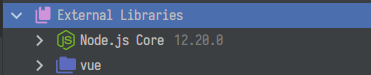
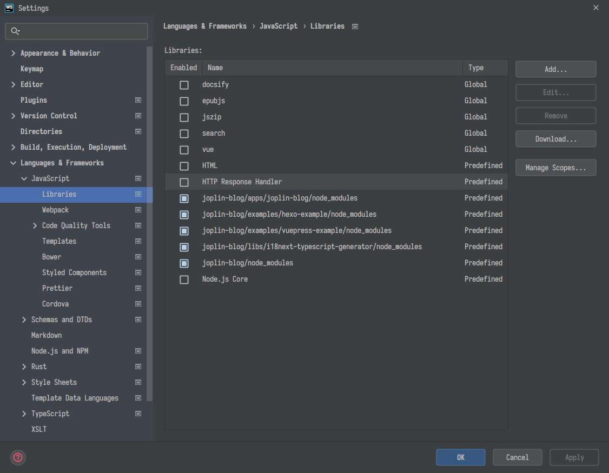
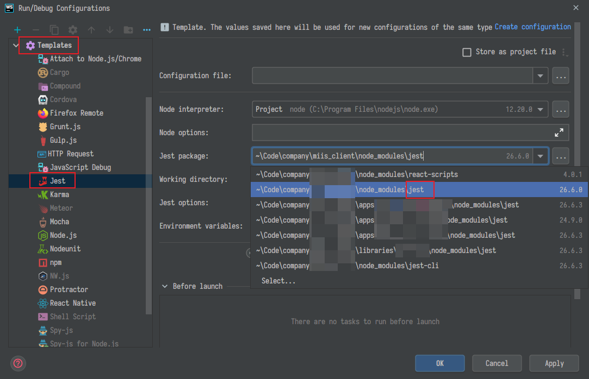

## WebStorm 全局默认配置

使用场景：\
使用 WebStorm 经常会遇到一种情况，在这个项目自顶了一些设置（**Settings** 而非 **Project Structure**，例如 自定义的 Maven，项目字符编码等等），到了新的项目全部恢复了默认值又要重新设定。

解决方案：\
通过 WebStorm 的默认设置（**File > Other Settings > Default Settings**）就可以设定全局的 **Settings**，而不需要在每个项目中重新设定一次。

> 默认设定按吾辈的理解应该是用于设定那些可以使项目级别的设置，例如 **代码检查**，**代码样式** 等。毕竟大部分的设置都是全局的嘛

## Alt-Enter 操作提示

Alter-Enter 大概是 WebStorm 最强大快捷键了，放在不同的位置有不同的功能。

- 警告（代码下面有黄色波浪线），会自动帮我们修复警告。
  代码重复，代码冗余（1/0 之类），多余的变量（声明完就立刻返回/声明完最多只使用了一次）
- 错误（代码下面有红色波浪线），一般会提出合适的修复建议。
  代码缺少注解，具体子类有未实现的方法
- 接口名（接口的名字），一般会提示可以生成实现类或者跳转到实现类
- 自动修复变量名的问题（不符合驼峰）
- 普通类名，一般会提示创建测试类，没有 JavaDoc 注释还会提示生成注释
- 字符串里面，会提示使用 [语言注入](#语言注入)
- 跳转到注入语言的编辑面板

## Double Shift 任意搜索

这个功能其实是集成了多个搜索，但有时候真的很好用，集成的功能包括

- 搜索 `Settings`（`CS-A`）：搜索 WebStorm 的设置
- 搜索 `class`（`C-N`）：搜索代码里的 class 类
- 搜索 `File`（`CS-N`）：搜索任何文件
- 搜索 `symbol`（`CSA-N`）：搜索符号，主要用于搜索 Spring MVC 路径
- 搜索 `Tool Windows`（`C-Tab`）：搜索工具窗口
- 搜索 `Run configuration`（`SA-F9/F10`）：搜索运行的配置项
- 搜索 `Action`（`Alt-Enter`）：搜索当前位置的代码可执行操作

如果你知道需要搜索的类型，请尽量使用单独的搜索选项，毕竟速度上会有一些优势

## 列编辑

列编辑是一个非常有趣的功能，可以让你同时编辑多行文本。

共有下面几种方式触发

- 使用鼠标中键下拉或上拉选中多行
- 使用 `A-J` 依次选择相同的代码片段，并使用 `SA-J` 取消选择
- 使用 `CSA-J` 选中当前文件所有匹配的代码片段
- 使用 `CA-Top/Bottom` 向上或向下选择多行（需要添加快捷键 `Editor Actions => Clone Caret Above/Clone Caret Below`）

GIF 演示


## 常用快捷键

> 快捷键想要熟练没有什么好的办法，却是只能多加使用了。如果你还不熟悉 WebStorm 的快捷键，可以使用 [Key Promoter X](https://github.com/halirutan/IntelliJ-Key-Promoter-X) 插件来提示你使用快捷键操作。

- 搜索
  - `C-N` ：搜索类
  - `CS-N` ：搜索文件
  - `CSA-N` ：搜索字段名(包含数据库字段)/方法名
  - `SS` ：搜索接口路径，类名，文件名，字段名/方法名
  - `CS-F`：全局搜索代码（该快捷键与 Windows10 的默认输入法冲突，可以修改快捷键，或者换用其他输入法）
- 面板操作
  - `ESC`：返回到编辑器中
  - `C-E` ：列出最近操作的文件历史以及可操作面板列表，然后可以通过输入单词跳转到对应的面板
  - `C-Tab -> *`：列出最近操作的文件历史以及可操作面板，并能通过单个字母导航到对应的操作面板（需要一直按住 `Ctrl`）
  - `A-Top/Bottom/Left/Right` ：左右是切换标签页，上下是切换方法
  - `F12` ：跳转到最后一个使用的面板
  - `CS-F12` ：收起/显示所有面板
  - `C-F12` ：在一个悬浮面板上列出所有字段/方法
  - `A-F11`: 列出可以快速运行的任务，支持 `npm/gulp`
- 选择
  - `C-W/CS-W` ：扩大/缩小选择区域范围
  - `CS-[/]`：选择至当前区域的开始/结束
  - `A/SA-J` ：选中/反选相同的单词进行列编辑（一个个的选中）
  - `CSA-J` ：选中多个相同的单词（当前文件全部选中）
- 代码跳转
  - `CA-Left/Right` ：跳转到上一个/下一个浏览的位置
  - `CS-Backspace` ：回退到上一个编辑的位置
  - `C-Top/Bottom/Left/Right`：左右是跳转到上一个/下一个单词，上下是移动屏幕（非移动光标）
  - `C-;` ：屏幕内任意跳转（需要安装 **Ace Jumper** 插件）
  - `Home` ：跳转到行首/编辑器的最左侧
  - `End` ：跳转到行尾
  - `C-Home/End` ：跳转到文件的开始/结尾
  - `C-Page Up/Page Down` ：跳转到当前屏幕的第一行/最后一行
  - `F2/S-F2` ：跳转到下一个/上一个错误/警告的位置
  - `C-Left/C-Right` ：跳转到上一个/下一个单词的位置
  - `C-B` ：跳转到变量/方法的声明处
  - `CS-B` ：跳转到变量/方法的具体实现处，如果不止一处就会列出下拉框
    > 注：这里吾辈修改了快捷键，毕竟 `CA-B` 单手按起来还真有点麻烦

> 注：在 WebStorm 看来左侧字母上面的数字键和右侧小键盘的数字键是不同的！
> 注: `Shift` 一般用于 **增强/取反** 功能。例如 `C-F` 搜索当前文件，`CS-F` 搜索所有文件，`F2` 跳转到下一个错误，`S-F2` 跳转到上一个错误。

## 常用插件

- [JRebel for IntelliJ](https://plugins.jetbrains.com/plugin/4441-jrebel-for-intellij)：做 Java Web 开发时真心免不了的 Plugin，能够有效解决 Web 容器（例如 Apache Tomcat）启动速度慢的问题（因为几乎所有的资源都能够热加载，热部署）
- [LiveEdit](https://plugins.jetbrains.com/plugin/7007-liveedit)：提供了 HTML/CSS/JavaScript 的实时预览和刷新功能
- [MybatisX](https://plugins.jetbrains.com/plugin/10119-mybatisx)：Mybatis 的一个辅助开发插件，能够比较愉快的使用 Mybatis 框架了
- [Alibaba Java Coding Guidelines](https://plugins.jetbrains.com/plugin/10046-alibaba-java-coding-guidelines)：Alibaba 出品的一个 Java 规范检查插件，能够规避一些不好的代码
- [Translation](https://plugins.jetbrains.com/plugin/8579-translation)：目前使用感觉最好的翻译插件，能够提供比较长的内容进行翻译（某些翻译插件只能翻译很短的内容）
- [String Manipulation](https://plugins.jetbrains.com/plugin/2162-string-manipulation)：字符串操作工具，可以方便对变量名或其他字符串修改为其他风格，例如将变量从 **驼峰命名**（Java 标准命名） 修改为 **下划线命名**（SQL 标准命名）或者 **中缀线命名**（HTML/CSS 标准命名）。
  > 其实这么多命名规范真心坑。。。
- [Key Promoter X](https://plugins.jetbrains.com/plugin/9792-key-promoter-x)：使用鼠标操作时提示对应的快捷键
- [Custom Postfix Templates](https://plugins.jetbrains.com/plugin/9862-custom-postfix-templates)：提供自定义的后缀模板
- [Markdown Navigator](https://plugins.jetbrains.com/plugin/7896-markdown-navigator)：WebStorm 平台的 Markdown 写作插件，比自带的 Markdown Support 要好很多，主要在需要写的 Markdown 内容中含有代码时比较方便
- [Maven Helper](https://plugins.jetbrains.com/plugin/7179-maven-helper)：一个 Apache Maven 的辅助操作插件
- [CodeGlance](https://plugins.jetbrains.com/plugin/7275-codeglance)：在编辑器右侧显示一块代码缩略图，主要为了方便使用滑块进行上下滑动
- [Grep Console](https://plugins.jetbrains.com/plugin/7125-grep-console)：自定义控制台的输出颜色
- [.ignore](https://plugins.jetbrains.com/plugin/7495--ignore)：在使用版本控制时，快速忽略某些文件/文件夹，目前支持广泛
- [CMD support](https://plugins.jetbrains.com/plugin/5834-cmd-support)：Cmd 支持，主要是方便在 WebStorm 中直接运行 bat 脚本
- [NodeJS](https://plugins.jetbrains.com/plugin/6098-nodejs)：集成了 NodeJS，可以直接在 WebStorm 中运行 NodeJS
- [Vue.js](https://plugins.jetbrains.com/plugin/9442-vue-js)：集成 Vue.js 框架
- [ESLint](https://plugins.jetbrains.com/plugin/7494-eslint)：前端代码规范
- [Prettier](https://plugins.jetbrains.com/plugin/10456-prettier)：根据上面 ESLint 的规范自动格式化代码
- [Properties to YAML Converter](https://plugins.jetbrains.com/plugin/8000-properties-to-yaml-converter)：将 `Properties` 文件快速转换为 `YAML` 格式的配置文件
- [WakaTime](https://plugins.jetbrains.com/plugin/7425-wakatime)：统计使用的编程语言，不同 IDE 的记录

## 语言注入

为某一段区域的注入其他语言，WebStorm 最常见的就是在 JavaScript 的字符串中注入了 HTML/CSS/JavaScript，使得在字符串内也有代码提示可用。

> 此功能常用于 JavaScript 字符串拼接 HTML 代码，当然目前这个需求在 ES6 中由 `模板字符串` 原生实现了。

我们也可以手动注入，例如为 Java 中的字符串注入 SQL 语言，这样在写 SQL 语句就不用跑到 SQL 编辑器那里写完 SQL 语句在粘贴过来了。

## Live Template/Postfix Template 模板

Live Template 模板就是那种在 Java 中输入 `sout` 就可以生成以下代码的模板功能，而这功能在 WebStorm 还可以自定义。

```java
System.out.println($END$);
```

例如吾辈就定义了 `autowired` 用于生成

```java
@Autowired private $BeanClass$ $BeanName$;
$END$
```

或者 `thread`

```java
new Thread(() -> {
    $END$
}).start();
```

此功能使用得当甚至能大量减少重复编码。不过相比之下另外一个代码生成功能吾辈更加喜欢，但 WebStorm 在 2018.2 版本之前并不支持自定义，所以功能上来说就显得稍弱一些，当然吾辈也使用插件（Custom Postfix Templates [GitHub](https://github.com/xylo/intellij-postfix-templates#download)）实现了自定义的需求。最新版本 WebStorm 原生支持了自定义功能（[WebStorm 官方介绍](https://blog.jetbrains.com/idea/2014/03/postfix-completion/)），但实现尚不完善。

此功能可以做到另外一种形式的模板字符串，例如输入 `"str".var` 然后回车会得到

```java
String $variableName$ = "str";$END$
```

或者 `"str".sout`

```java
Sysout.out.println("str");
```

吾辈也自定义一些，例如输入了 `"str".val`，会生成

```java
final String $variableName$ = "str";$END$
```

## 一些有用的配置项

### soft wrap 强制换行

WebStorm 在一行过长时会出现横向滚动条，那我们不想要它出现以便于能直接使用键盘就能看完要怎么办呢？

可以在 _Settings ⇒ Editor ⇒ General ⇒ Soft Wraps_ 中找到设置，将 **Soft-wrap files** 的值修改为 `*` 即可。


### 根据源代码自动滚动项目

可以在跳转文件时，使文件目录自动聚焦在当前编辑的文件上，这在很多时候是有利于查看目录/文件的。

2019.3 之后

在 _Project ⇒ Always Select Opened File_ 中可以找到这个配置，启用即在整个项目中启用了。


2019.3 之前

在 _Project ⇒ Tool ⇒ Autoscroll from Source_ 中可以找到这个配置，启用即在整个项目中启用了。


### 项目外部依赖

在传统 web 项目中，会有需要让 IDE 索引通过 script 标签引入的依赖，但现代前端绝大多数时候不应该让 IDE 处理。



你需要在设置 _File | Settings | Languages & Frameworks | JavaScript | Libraries_ 中取消不需要索引的依赖项。



### 在 TypeScript 项目中使用强类型提示

在 TypeScript 项目中，我们的代码提示应该基于 TypeScript 而非 WebStorm 的索引，因为前者要精确的多。


涉及到以下几个选项

- _File | Settings | Editor | General | Code Completion => Only type-based completion_

### typescript 项目中禁用 WebStorm 的索引

## 复制 WebStorm 提示的报错

> 这个技巧的发现来源于一个同事

有时候 WebStorm 提示我们错误，当我们把鼠标放在上面时会有一个 `Tooltip`。但当我们想要复制这个错误时，却发现选择时 `Tooltip` 很容易消失，即便在较新版本中进行了改进，但想要复制仍然是非常痛苦的一件事，那么如何更加简单的复制错误呢？
实际上，当我们将光标移动到错误上面时，左下角的状态栏中会有该错误并且可以右键复制！


> 相关问题参考：<https://youtrack.jetbrains.com/issue/WebStorm-70943>，这是一个相当古老（2011 年）的问题，但 JetBrains 的开发者一开始甚至不认为这是一个问题，直到最近才着手修复它。
> 附：或许 JetBrains 的开发人员并不需要面向 Google 编程？#笑

## 浏览器报错在 WebStorm 打开相应文件

> 参考：
>
> - [React 调试的时候如何打开指定的编辑器 /webstorm](https://juejin.im/post/6844903967206408206)

react 项目下其实就是添加环境变量 `REACT_EDITOR` 而已，可以使用 `.env.local` 进行配置

```env
REACT_EDITOR=[WebStorm 的路径]
```

## 设定默认 jest 运行单元测试

在包含 react-scripts 依赖的项目中，WebStorm 会默认使用 react-scripts 运行测试，这在单体项目中当然很好，但如果是 monorepo，则会出现一些问题。react-scripts 运行时会强制修改 `tsconfig.json/react-app-env.d.ts`，这在一些 node 子模块中会出现问题，而 react-scripts 目前还不能关闭这个功能。所以只能修改 WebStorm 的测试运行工具了，可以在 `Edit configuration` 中修改 `Jest => Jest Package` 字段值为 `jest`，更推荐设置 `Templates => Jest => Jest Package` 字段，因为它可以一劳永逸。



> 参考：[How to configure react-script so that it doesn't override tsconfig.json on 'start'](https://stackoverflow.com/questions/53794875)
