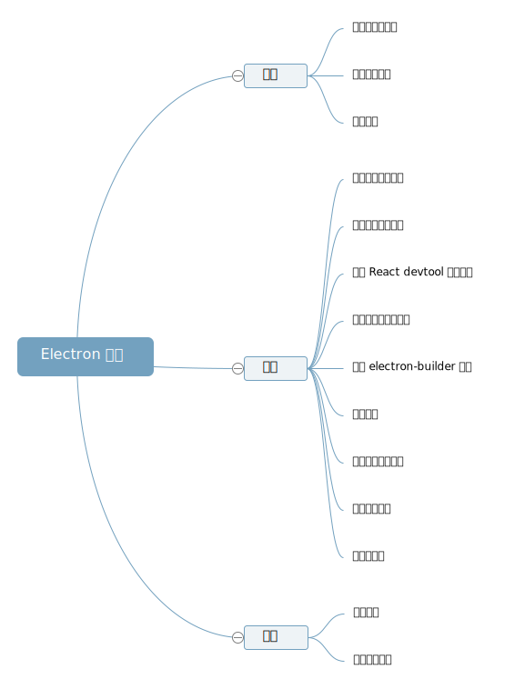

> 注: 该系列博客存在前后顺序依赖，请尽量从前往后通读一遍。
> [GitHub 项目](https://github.com/rxliuli/electron_example)

这是一个关于如何使用 React + Electron 开发桌面应用的一些经验之谈，可能包含一些主观意见，但或许仍然能对你有所帮助。

## 目的

那么，吾辈到底是想写一些什么呢？前端工程化？electron 项目的怪癖？还是其他什么？
吾辈想完成一个使用 electron 开发的的系列文章，说明开发 electron 的基本流程、各种选择、以及涉及到的工程化的内容，并在说明这些的过程中完成一个桌面应用程序。

> 在这个系列中，会使用到一些额外的技术，如果你不了解可能也没太大问题，但了解之后才能更顺畅的阅读，参考: [技术栈简介及选择](/p/74b1ec3c598940c2afbd17cdd50e31cb)

## 目录

- [简介](/p/da25fbc33fa248b196ea573b661dbe14)
- [技术栈简介及选择](/p/74b1ec3c598940c2afbd17cdd50e31cb)
- [基本项目搭建](/p/475d21afd2404d5ba1f71f600c44da09)
- [使用 electron-builder 打包](/p/63f0a26fdd3743668b11410a10625c1b)
- [渲染、主进程通信](/p/6e778ce220e042a0902e7a85976e7e47)
- [在渲染、主进程间共享数据](/p/db74e6e5d2444bc3b6e185a7b338bbf6)
- [自定义窗口顶栏](/p/9d55c013167a4e6d802fde969291c34b)
- [自动更新](/p/0f342a17caae4f1e845a543770008e35)
- [常见问题](/p/76072311817b4c1985ab5746e8f91d87)
- [自定义协议](/p/ff86c5343d38460a8e78a62617f9eace)
- [开发环境优化](/p/1527b67fbd78494cb716e2db4b8fb688)
